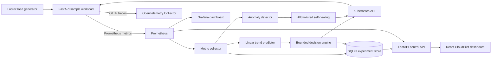

# CloudPilot architecture

## Controller ownership

Only one component owns replicas at a time:

- **Fixed:** CloudPilot maintains the stored fixed replica count and removes the HPA.
- **HPA:** CloudPilot creates the Kubernetes Horizontal Pod Autoscaler and makes no replica writes.
- **Predictive:** CloudPilot removes the HPA, forecasts near-future request rate, converts demand to replicas, clamps the result, and applies it after a cooldown.

## Prediction and safeguards

The model performs ordinary least-squares linear regression over at most 60 recent samples. It calculates root mean squared error to derive a confidence score and refuses predictive scaling below the confidence threshold. Forecasts are bounded to prevent a noisy window from creating an extreme extrapolation. The policy then applies minimum/maximum replicas, per-pod capacity, headroom, and a scale cooldown.

Self-healing is intentionally restricted. High error rate or a restart-loop signal may trigger a rollout restart, with a three-minute recovery cooldown. The API exposes only latency, error, and rollout-restart demonstrations; it cannot execute arbitrary commands.

## Data and observability

- Prometheus collects request rate, process CPU, memory, latency histograms, error counts, controller state, forecasts, and recovery counters.
- OpenTelemetry emits HTTP spans through OpenTelemetry Protocol (OTLP) to the local collector.
- SQLite stores telemetry snapshots, decisions, incidents, scaling modes, and experiment summaries.
- Grafana provides the technical view; React provides the explainable faculty/demo view.

The Compose deployment uses simulation mode so the complete decision path can be shown without Kubernetes. The kind deployment uses a namespace-scoped service account and Role to patch only the named workload Deployment and Horizontal Pod Autoscaler.
